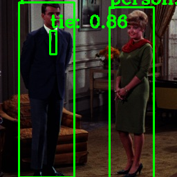

# ailia-models-tflite

Quantized tflite models for ailia TFLite Runtime

# About ailia TFLite Runtime

ailia TF Lite Runtime is a TensorFlow Lite compatible inference engine. Written in C99, it supports inference in Non-OS and RTOS. It also supports high-speed inference using Intel MKL on a PC, and operates 29 times faster than the official TensorFlow Lite.

# Install

Get the ailia TF Lite Runtime package from [ax Inc](https://axinc.jp/en/). Run the following command.

```
cd ailia_tflite_runtime/python
python3 bootstrap.py
pip3 install .
```

# Models

## Face detection

| | Model | Reference | Exported From | Netron |
|:------------:|:------------:|:------------:|:------------:|:------------:|
| [](face_detection/blazeface/) | [BlazeFace](/face_detection/blazeface/) | [PINTO_model_zoo](https://github.com/PINTO0309/PINTO_model_zoo/tree/master/030_BlazeFace/04_full_integer_quantization) | Tensorflow | [Netron](https://netron.app/?url=https://storage.googleapis.com/ailia-models-tflite/blazeface/face_detection_front_128_full_integer_quant.tflite) |

## Face recognition

| | Model | Reference | Exported From | Netron |
|:------------:|:------------:|:------------:|:------------:|:------------:|
| [](face_recognition/facemesh/) | [Face Mesh](/face_recognition/facemesh/) | [PINTO_model_zoo](https://github.com/PINTO0309/PINTO_model_zoo/tree/main/032_FaceMesh/04_full_integer_quantization) | TensorFlow | [Netron](https://netron.app/?url=https://storage.googleapis.com/ailia-models-tflite/facemesh/face_landmark_192_full_integer_quant_uint8.tflite) |

## Hand recognition

| | Model | Reference | Exported From | Netron |
|:------------:|:------------:|:------------:|:------------:|:------------:|
| [](hand_recognition/blazehand/) | [Blaze Hand](/hand_recognition/blazehand/) | [PINTO_model_zoo](https://github.com/PINTO0309/PINTO_model_zoo/tree/main/032_FaceMesh/033_Hand_Detection_and_Tracking) | TensorFlow | [Netron](https://netron.app/?url=https://storage.googleapis.com/ailia-models-tflite/blazehand/hand_landmark_new_256x256_full_integer_quant.tflite) |

## Image classification

| | Model | Reference | Exported From | Netron |
|:------------:|:------------:|:------------:|:------------:|:------------:|
| [](image_classification/mobilenetv1/) | [MobileNet](/image_classification/mobilenetv1/) | [MobileNets: Efficient Convolutional Neural Networks for Mobile Vision Applications](https://arxiv.org/abs/1704.04861) | Keras | [Netron](https://netron.app/?url=https://storage.googleapis.com/ailia-models-tflite/mobilenetv1/mobilenetv1_quant.tflite) |
| [](image_classification/mobilenetv2/) | [MobileNetV2](/image_classification/mobilenetv2/) | [MobileNetV2: Inverted Residuals and Linear Bottlenecks](https://arxiv.org/abs/1801.04381) | Keras | [Netron](https://netron.app/?url=https://storage.googleapis.com/ailia-models-tflite/mobilenetv2/mobilenetv2_quant.tflite) |
| [](image_classification/resnet50/) | [ResNet50](/image_classification/resnet50/) | [tf.keras.applications.resnet50.ResNet50](https://www.tensorflow.org/api_docs/python/tf/keras/applications/resnet50/ResNet50) | Keras | [Netron](https://netron.app/?url=https://storage.googleapis.com/ailia-models-tflite/resnet50/resnet50_quant.tflite) |

## Image segmentation

| | Model | Reference | Exported From | Netron |
|:------------:|:------------:|:------------:|:------------:|:------------:|
| [](image_segmentation/deeplabv3plus/) | [DeepLabv3+](/image_segmentation/deeplabv3plus/) | [PINTO_model_zoo](https://github.com/PINTO0309/PINTO_model_zoo/tree/master/026_mobile-deeplabv3-plus/03_integer_quantization)| TensorFlow | [Netron](https://netron.app/?url=https://storage.googleapis.com/ailia-models-tflite/deeplabv3plus/deeplab_v3_plus_mnv2_decoder_256_integer_quant.tflite) |

## Object detection

| | Model | Reference | Exported From | Netron |
|:------------:|:------------:|:------------:|:------------:|:------------:|
| [](object_detection/mobilenetssd/) | [MobileNetV2-SSDLite](/object_detection/mobilenetssd/) | [PINTO_model_zoo](https://github.com/PINTO0309/PINTO_model_zoo/tree/master/006_mobilenetv2-ssdlite/01_coco/03_integer_quantization) | TensorFlow | [Netron](https://netron.app/?url=https://storage.googleapis.com/ailia-models-tflite/mobilenetssd/ssdlite_mobilenet_v2_coco_300_integer_quant_with_postprocess.tflite) |
| [](object_detection/yolov3-tiny/) | [YOLOv3 tiny](/object_detection/yolov3-tiny/) | [tensorflow-yolov4-tflite](https://github.com/hunglc007/tensorflow-yolov4-tflite) | TensorFlow | [Netron](https://netron.app/?url=https://storage.googleapis.com/ailia-models-tflite/yolov3-tiny/yolov3-tiny-416_full_integer_quant.tflite) |

# Options

You can benchmark with the -b option. You can use the official TensorFlow Lite with the --tflite option.