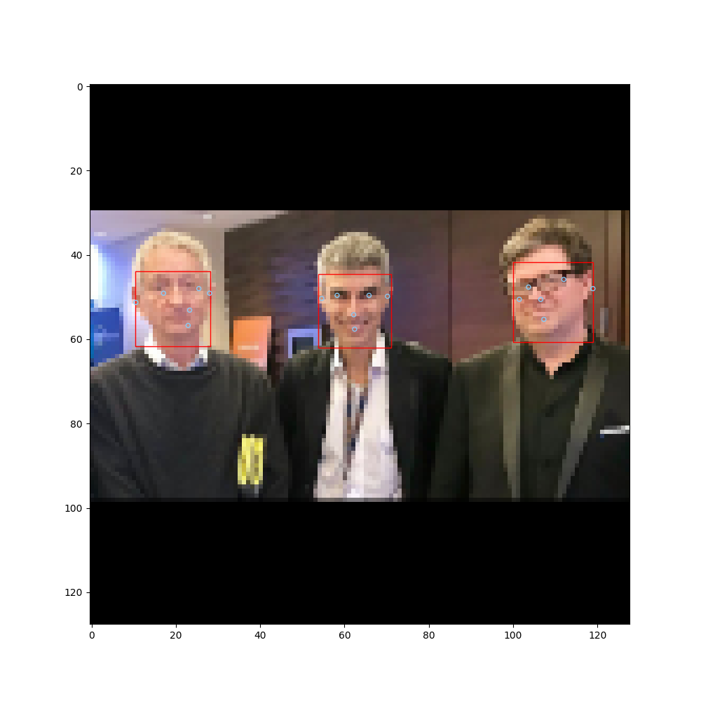
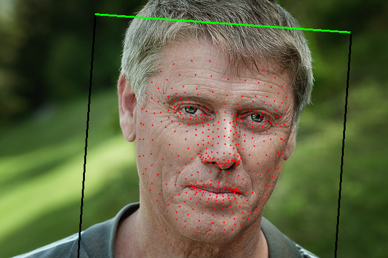
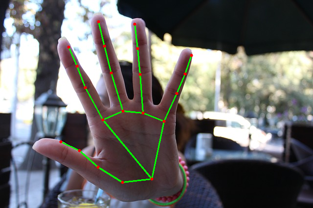
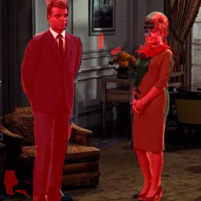
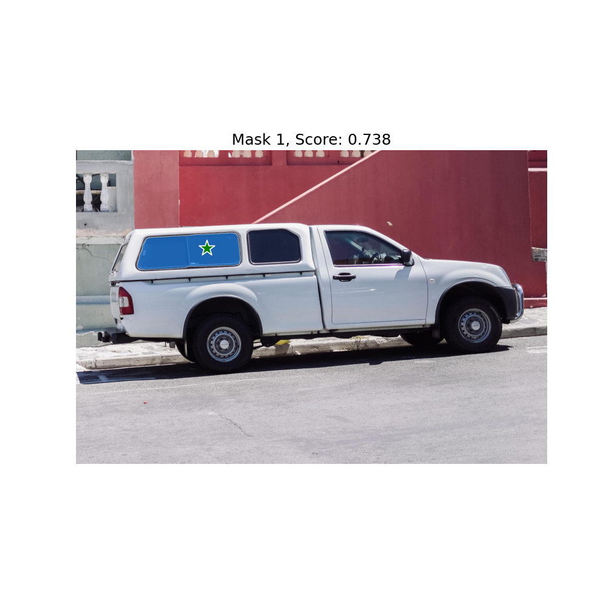
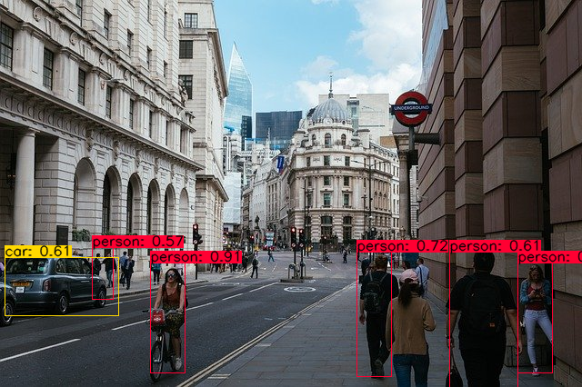
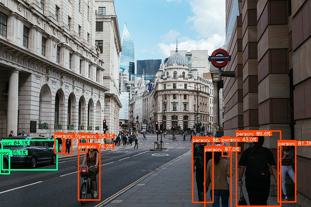
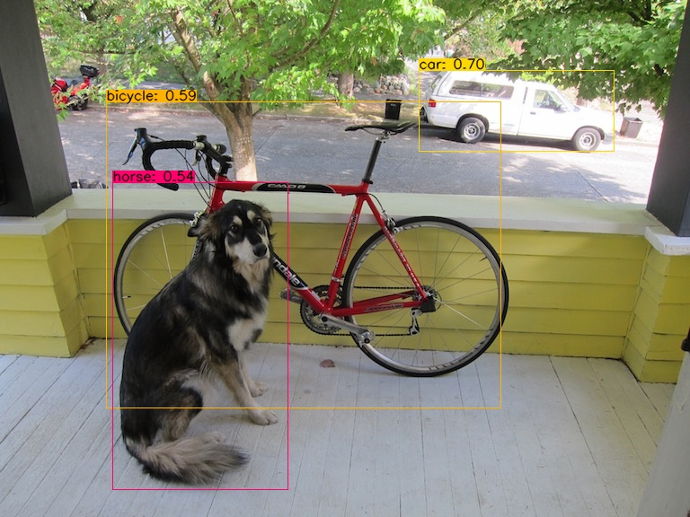
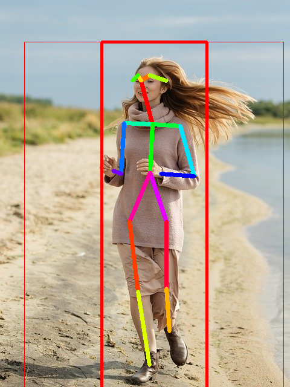
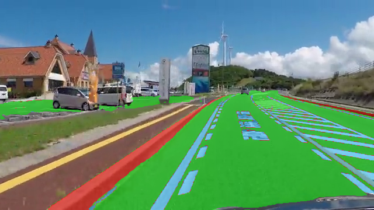

# ailia-models-tflite

Quantized tflite models for ailia TFLite Runtime

# About ailia TFLite Runtime

ailia TFLite Runtime is a TensorFlow Lite compatible inference engine. Written in C99, it supports inference in Non-OS and RTOS. It also supports high-speed inference using Intel MKL on a PC. In the Android environment, we provide a Unity Package, which also supports NPU inference using NNAPI.

# Install

## NEW - ailia TFLite Runtime can now be installed with "pip3 install ailia_tflite" ! 

Run the following command. The Python version is compatible with Windows, macOS, and Linux. It is also planned to support Arm Linux in the future.

```
pip3 install ailia_tflite
```

# Models

## Background removal

| | Model | Reference | Exported From | Supported Ailia Version |
|:------------:|:------------:|:------------:|:------------:|:------------:|
| [](background_removal/u2net/) | [u2net](/background_removal/u2net/) | [U^2-Net: Going Deeper with Nested U-Structure for Salient Object Detection](https://github.com/NathanUA/U-2-Net)| TensorFlow | 1.1.0 |

## Depth estimation

| | Model | Reference | Exported From | Supported Ailia Version |
|:------------:|:------------:|:------------:|:------------:|:------------:|
| [](depth_estimation/midas/) | [Midas](/depth_estimation/midas/) | [Towards Robust Monocular Depth Estimation: Mixing Datasets for Zero-shot Cross-dataset Transfer](https://github.com/intel-isl/MiDaS) | Pytorch | 1.1.7 |

## Face detection

| | Model | Reference | Exported From | Supported Ailia Version |
|:------------:|:------------:|:------------:|:------------:|:------------:|
| [](face_detection/blazeface/) | [BlazeFace](/face_detection/blazeface/) | [PINTO_model_zoo](https://github.com/PINTO0309/PINTO_model_zoo/tree/master/030_BlazeFace/04_full_integer_quantization) | TensorFlow | 1.0.0 |

## Face recognition

| | Model | Reference | Exported From | Supported Ailia Version |
|:------------:|:------------:|:------------:|:------------:|:------------:|
| [](face_recognition/facemesh/) | [Face Mesh](/face_recognition/facemesh/) | [PINTO_model_zoo](https://github.com/PINTO0309/PINTO_model_zoo/tree/main/032_FaceMesh/04_full_integer_quantization) | TensorFlow | 1.0.0 |
| [](face_recognition/face_classification/) | [face_classification](/face_recognition/face_classification/) | [Real-time face detection and emotion/gender classification](https://github.com/oarriaga/face_classification) | TensorFlow | 1.1.1 |

## Hand recognition

| | Model | Reference | Exported From | Supported Ailia Version |
|:------------:|:------------:|:------------:|:------------:|:------------:|
| [](hand_recognition/blazehand/) | [Blaze Hand](/hand_recognition/blazehand/) | [PINTO_model_zoo](https://github.com/PINTO0309/PINTO_model_zoo/tree/main/033_Hand_Detection_and_Tracking) | TensorFlow | 1.0.0 |

## Image classification

| | Model | Reference | Exported From | Supported Ailia Version |
|:------------:|:------------:|:------------:|:------------:|:------------:|
| [](image_classification/mobilenetv1/) | [MobileNet](/image_classification/mobilenetv1/) | [MobileNets: Efficient Convolutional Neural Networks for Mobile Vision Applications](https://arxiv.org/abs/1704.04861) | Keras | 1.0.0 |
| [](image_classification/mobilenetv2/) | [MobileNetV2](/image_classification/mobilenetv2/) | [MobileNetV2: Inverted Residuals and Linear Bottlenecks](https://arxiv.org/abs/1801.04381) | Keras | 1.0.0 |
| [](image_classification/resnet50/) | [ResNet50](/image_classification/resnet50/) | [tf.keras.applications.resnet50.ResNet50](https://www.tensorflow.org/api_docs/python/tf/keras/applications/resnet50/ResNet50) | Keras | 1.0.0 |
| [](image_classification/efficientnet_lite/) | [EfficientnetLite](/image_classification/efficientnet_lite/) | [efficientnet-lite-keras](https://github.com/sebastian-sz/efficientnet-lite-keras) | Keras | 1.0.0 |
| [](image_classification/squeezenet/) | [SqueezeNet](/image_classification/squeezenet/) | [keras_squeezenet2](https://github.com/daviddexter/keras_squeezenet2) | Keras | 1.0.0 |
| [](image_classification/vgg16/) | [vgg16](/image_classification/vgg16/) | [VGG16 - Torchvision]( https://pytorch.org/vision/main/models/generated/torchvision.models.vgg16.html ) | Pytorch | 1.1.7 for int8, 1.1.9 for float |
| [](image_classification/googlenet/) | [googlenet](/image_classification/googlenet/) | [GOOGLENET]( https://pytorch.org/hub/pytorch_vision_googlenet/) | Pytorch | 1.1.10 |

## Image segmentation

| | Model | Reference | Exported From | Supported Ailia Version |
|:------------:|:------------:|:------------:|:------------:|:------------:|
| [](image_segmentation/deeplabv3plus/) | [DeepLabv3+](/image_segmentation/deeplabv3plus/) | [PINTO_model_zoo](https://github.com/PINTO0309/PINTO_model_zoo/tree/master/026_mobile-deeplabv3-plus/03_integer_quantization)| TensorFlow | 1.0.0 |
| [](image_segmentation/hrnet_segmentation/) | [HRNet-Semantic-Segmentation](/image_segmentation/hrnet_segmentation/) | [HRNet-Semantic-Segmentation](https://github.com/HRNet/HRNet-Semantic-Segmentation)| TensorFlow | 1.1.0 |
| [](image_segmentation/segment-anything-2/) | [SegmentAnthing2](image_segmentation/segment-anything-2/) | [SegmentAnthing2](https://github.com/facebookresearch/sam2) | Torch | 1.2.3 |

## Object detection

| | Model | Reference | Exported From | Supported Ailia Version |
|:------------:|:------------:|:------------:|:------------:|:------------:|
| [](object_detection/yolov3-tiny/) | [YOLOv3 tiny](/object_detection/yolov3-tiny/) | [tensorflow-yolov4-tflite](https://github.com/hunglc007/tensorflow-yolov4-tflite) | TensorFlow | 1.0.0 |
| [](object_detection/yolox/) | [YOLOX](/object_detection/yolox/) | [YOLOX](https://github.com/Megvii-BaseDetection/YOLOX) | Pytorch | 1.1.1 |
| [](object_detection/efficientdet_lite/) | [EfficientDetLite](/object_detection/efficientdet_lite/) | [PINTO_model_zoo](https://github.com/PINTO0309/PINTO_model_zoo/tree/main/103_EfficientDet_lite) | TensorFlow | 1.1.3 |


## Pose estimation

| | Model | Reference | Exported From | Supported Ailia Version |
|:------------:|:------------:|:------------:|:------------:|:------------:|
| [](pose_estimation/pose_resnet/) | [pose_resnet](/pose_estimation/pose_resnet/) | [Simple Baselines for Human Pose Estimation and Tracking](https://github.com/microsoft/human-pose-estimation.pytorch) | Pytorch | 1.1.7 for int8, 1.1.9 for float |

## Road detection

| | Model | Reference | Exported From | Supported Ailia Version |
|:------------:|:------------:|:------------:|:------------:|:------------:|
| [](road_detection/road-segmentation-adas/) | [road-segmentation-adas](/road_detection/road-segmentation-adas/) | [OpenVINO - road-segmentation-adas-0001](https://docs.openvinotoolkit.org/latest/omz_models_model_road_segmentation_adas_0001.html) | OpenVINO | 1.1.9 |

## Super resolution

| | Model | Reference | Exported From | Supported Ailia Version |
|:------------:|:------------:|:------------:|:------------:|:------------:|
| [](super_resolution/espcn/) | [ESPCN](/super_resolution/espcn/) | [Image Super-Resolution using an Efficient Sub-Pixel CNN](https://keras.io/examples/vision/super_resolution_sub_pixel/) | TensorFlow | 1.1.0 |
| [](super_resolution/srresnet/) | [srresnet](/super_resolution/srresnet/) | [Photo-Realistic Single Image Super-Resolution Using a Generative Adversarial Network](https://github.com/twtygqyy/pytorch-SRResNet) | Pytorch | 1.1.10 |

# Options

You can benchmark with the -b option. You can use the official TensorFlow Lite with the --tflite option.

# Launchar

You can use cui launchar.

```
python3 launchar.py
```

# i.MX8 Support Status

[See NXP](NXP.md)