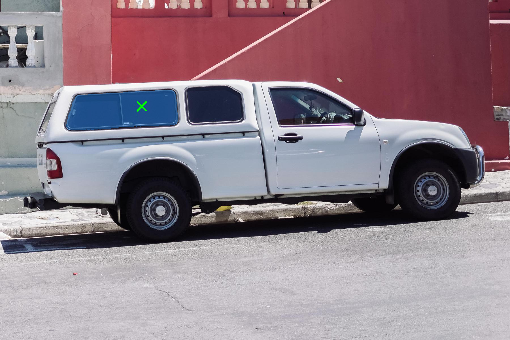

# Segment Anything 2

## Image mode

### Input


(Image from https://github.com/facebookresearch/segment-anything/blob/main/notebooks/images/truck.jpg)

### Output



## Video mode

### Input


(Image from https://github.com/facebookresearch/segment-anything-2/tree/main/notebooks/videos/bedroom)

### Output


## Usage
Automatically downloads the onnx and prototxt files on the first run.
It is necessary to be connected to the Internet while downloading.

For the sample image,
```bash
$ python3 segment-anything-2.py
```

For the sample video,
```bash
$ python3 segment-anything-2.py -v demo
```

For the webcam,
```bash
$ python3 segment-anything-2.py -v 0 --pos 960 540
```

Improve performance,
```bash
$ python3 segment-anything-2.py -v 0 --num_mask_mem 2 --max_obj_ptrs_in_encoder 2
```

If you want to specify the input image, put the image path after the `--input` option.  
You can use `--savepath` option to change the name of the output file to save.
```bash
$ python3 segment-anything-2.py --input IMAGE_PATH --savepath SAVE_IMAGE_PATH
```

If you want to specify the positive point, put the coordinates(x,y) after the `--pos` option.
```bash
$ python3 segment-anything-2.py --pos 500 375
```

And if you want to specify the negative point, put the coordinates after the `--neg` option.
```bash
$ python3 segment-anything-2.py --pos 500 375 --neg 360 405
```

If you want to specify the box, put the coordinates(x1,y1,x2,y2) after the `--box` option.
```bash
$ python3 segment-anything-2.py --box 425 600 700 875
```

These options can be combined.
```bash
$ python3 segment-anything-2.py --pos 500 375 --pos 1125 625
```

```bash
$ python3 segment-anything-2.py --box 425 600 700 875 --neg 575 750
```

By adding the `--model_type` option, you can specify model type which is selected from "hiera_l",  "hiera_b+",  "hiera_s", and "hiera_t". (default is hiera_l)
```bash
$ python3 segment-anything-2.py --model_type hiera_l
```

## Reference

- [Segment Anything 2](https://github.com/facebookresearch/segment-anything-2)

## Framework

Pytorch

## Model Format

tflite

## Netron

### hiera_l

- [image_encoder_hiera_l.tflite](https://netron.app/?url=https://storage.googleapis.com/ailia-models-tflite/segment-anything-2/image_encoder_hiera_l.tflite)  
- [mask_decoder_hiera_l.tflite](https://netron.app/?url=https://storage.googleapis.com/ailia-models-tflite/segment-anything-2/mask_decoder_hiera_l.tflite)  
- [prompt_encoder_hiera_l.tflite](https://netron.app/?url=https://storage.googleapis.com/ailia-models-tflite/segment-anything-2/prompt_encoder_hiera_l.tflite)  
- [memory_attention_hiera_l.tflite](https://netron.app/?url=https://storage.googleapis.com/ailia-models-tflite/segment-anything-2/memory_attention_hiera_l.tflite)  
- [memory_encoder_hiera_l.tflite](https://netron.app/?url=https://storage.googleapis.com/ailia-models-tflite/segment-anything-2/memory_encoder_hiera_l.tflite)  
- [mlp_hiera_l.tflite](https://netron.app/?url=https://storage.googleapis.com/ailia-models-tflite/segment-anything-2/mlp_hiera_l.tflite)  

### hiera_b+

- [image_encoder_hiera_b+.tflite](https://netron.app/?url=https://storage.googleapis.com/ailia-models-tflite/segment-anything-2/image_encoder_hiera_b+.tflite)  
- [mask_decoder_hiera_b+.tflite](https://netron.app/?url=https://storage.googleapis.com/ailia-models-tflite/segment-anything-2/mask_decoder_hiera_b+.tflite)  
- [prompt_encoder_hiera_b+.tflite](https://netron.app/?url=https://storage.googleapis.com/ailia-models-tflite/segment-anything-2/prompt_encoder_hiera_b+.tflite)  
- [memory_attention_hiera_b+.tflite](https://netron.app/?url=https://storage.googleapis.com/ailia-models-tflite/segment-anything-2/memory_attention_hiera_b+.tflite)  
- [memory_encoder_hiera_b+.tflite](https://netron.app/?url=https://storage.googleapis.com/ailia-models-tflite/segment-anything-2/memory_encoder_hiera_b+.tflite)  
- [mlp_hiera_b+.tflite](https://netron.app/?url=https://storage.googleapis.com/ailia-models-tflite/segment-anything-2/mlp_hiera_b+.tflite)  

### hiera_s

- [image_encoder_hiera_s.tflite](https://netron.app/?url=https://storage.googleapis.com/ailia-models-tflite/segment-anything-2/image_encoder_hiera_s.tflite)  
- [mask_decoder_hiera_s.tflite](https://netron.app/?url=https://storage.googleapis.com/ailia-models-tflite/segment-anything-2/mask_decoder_hiera_s.tflite)  
- [prompt_encoder_hiera_s.tflite](https://netron.app/?url=https://storage.googleapis.com/ailia-models-tflite/segment-anything-2/prompt_encoder_hiera_s.tflite)  
- [memory_attention_hiera_s.tflite](https://netron.app/?url=https://storage.googleapis.com/ailia-models-tflite/segment-anything-2/memory_attention_hiera_s.tflite)  
- [memory_encoder_hiera_s.tflite](https://netron.app/?url=https://storage.googleapis.com/ailia-models-tflite/segment-anything-2/memory_encoder_hiera_s.tflite)  
- [mlp_hiera_s.tflite](https://netron.app/?url=https://storage.googleapis.com/ailia-models-tflite/segment-anything-2/mlp_hiera_s.tflite)  

### hiera_t

- [image_encoder_hiera_t.tflite](https://netron.app/?url=https://storage.googleapis.com/ailia-models-tflite/segment-anything-2/image_encoder_hiera_t.tflite)  
- [mask_decoder_hiera_t.tflite](https://netron.app/?url=https://storage.googleapis.com/ailia-models-tflite/segment-anything-2/mask_decoder_hiera_t.tflite)  
- [prompt_encoder_hiera_t.tflite](https://netron.app/?url=https://storage.googleapis.com/ailia-models-tflite/segment-anything-2/prompt_encoder_hiera_t.tflite)  
- [memory_attention_hiera_t.tflite](https://netron.app/?url=https://storage.googleapis.com/ailia-models-tflite/segment-anything-2/memory_attention_hiera_t.tflite)  
- [memory_encoder_hiera_t.tflite](https://netron.app/?url=https://storage.googleapis.com/ailia-models-tflite/segment-anything-2/memory_encoder_hiera_t.tflite)  
- [mlp_hiera_t.tflite](https://netron.app/?url=https://storage.googleapis.com/ailia-models-tflite/segment-anything-2/mlp_hiera_t.tflite)  
