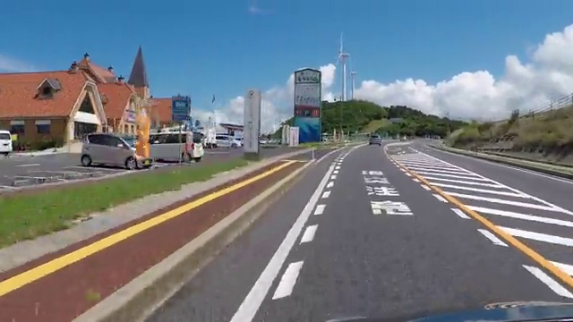

# road-segmentation-adas-0001

## Input



(Image from https://www.pexels.com/ja-jp/video/854669/)

Shape : (1, 512, 896, 3) BGR channel order

## Output


Shape : (1, 512, 896, 4)

### Category

```
CATEGORY = {
    'BG': 0,
    'road': 1,
    'curb': 2,
    'mark': 3,
}
```

### Usage
Automatically downloads the tflite files on the first run.
It is necessary to be connected to the Internet while downloading.

For the sample image,
```bash
$ python3 road-segmentation-adas.py
```

If you want to specify the input image, put the image path after the `--input` option.  
You can use `--savepath` option to change the name of the output file to save.
```bash
$ python3 road-segmentation-adas.py --input IMAGE_PATH --savepath SAVE_IMAGE_PATH
```

By adding the `--video` option, you can input the video.   
If you pass `0` as an argument to VIDEO_PATH, you can use the webcam input instead of the video file.
```bash
$ python3 road-segmentation-adas.py --video VIDEO_PATH
```

Two versions of the model are provided: full integer quantization (8-bit) and full precision floating point (32-bit). 
By default, the full integer quantization is used but the user can select the other version by passing the --float flag.
```bash
$ python3 road-segmentation-adas.py --float
```

## Reference

- [OpenVINO - Open Model Zoo repository - road-segmentation-adas-0001](https://github.com/openvinotoolkit/open_model_zoo/tree/master/models/intel/road-segmentation-adas-0001)
- [OpenVINO - road-segmentation-adas-0001](https://docs.openvinotoolkit.org/latest/omz_models_model_road_segmentation_adas_0001.html)

## Framework

tensorflow 2.12.0

## Netron

[road-segmentation-adas-0001_float32.tflite](https://netron.app/?url=https://storage.googleapis.com/ailia-models-tflite/road-segmentation-adas/road-segmentation-adas-0001_float32.tflite)
[road-segmentation-adas-0001_quant.tflite](https://netron.app/?url=https://storage.googleapis.com/ailia-models-tflite/road-segmentation-adas/road-segmentation-adas-0001_quant.tflite)
